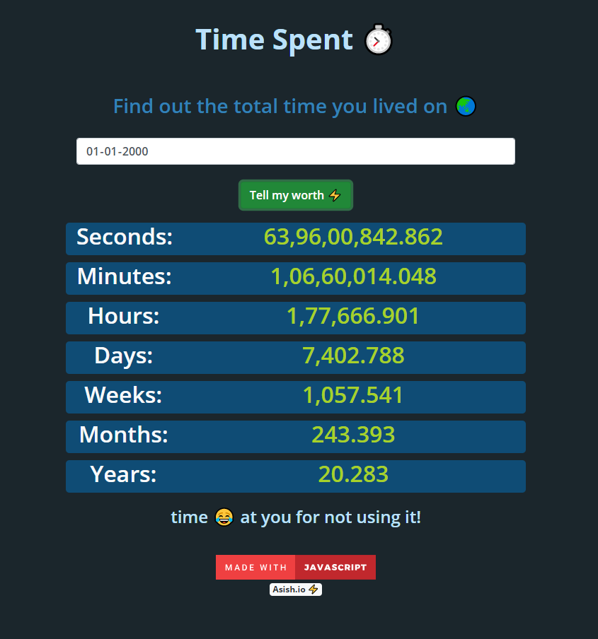

# Time Spent ⏰
 Find out the total time you lived on 🌏

### Check it out [here]!
 

## Overview 👀

### A fun little web app that tells you the total time you lived on earth in all the time formats

- Nothing but simple Javascript Date objects to play with 

## WIP 🛠
- Better UI maybe?😬
- Mobile APP

## How To Contribute🤝 
- Yes,it is open source you can clone and change code to your need.
- Most of the code is self explanatory, anyhow
- for any clarification on code or want to contribute contact 
- [Gmail] / [Twitter] /[LinkedIn]

[Gmail]: <mailto:vashish888@gmail.com>
[LinkedIn]: <https://www.linkedin.com/in/asish-raju-7a0b90192>
[Twitter]: <https://twitter.com/vashish888>
 [here]:<https://asishraju.github.io/Time-Spent/>